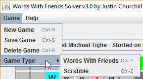

# words_with_friends_solver
Solver for the game words with friends (or scrabble).

Java implementation; compile to a jar file and execute under the JRE.

## Solver

Words with friends is a game identical to scrabble except that some tile point values are different, and the locations of bonus squares on the board are different.

At any point in time, the board has a state, and you, the player, have a tray of letters that can be used to place a word on the board. Finding the best possible move in this situation is a challenging one - this solver aims to make it simple.

Simply put, this solver looks for all possible placements of all words that can be made with your letters and the letters on the board. It finds every possible move, and then lists them to you in point order descending.

Granted, the highest-point move might not be the best - opening up a triple word score to your opponent, for example, might be a bad idea. For this, the user must use their own judgment.

When updating the board state, letters may be typed directly on the squares of the board, but this is tedious. The solver offers a "Place Your Word" button to do this automatically for your selected word. When your opponent plays a word, updating the board state would be similarly tedious. To avoid this, you can type the word your opponent played into the lower-left box and click "Fit Word To Board", which will show all possible locations that word could have been played. Choose from the list above the one that your opponent actually played, and then click "Place Friend's Word".

Finally, this solver offers a few additional features:

- Saving game state on the filesystem, for multiple games. Words With Friends is a very asynchronous game, and you can't be expected to keep the solver program open for that long.
- Switching game type between "Words with Friends" and "Scrabble" which just changes point values according to their respective rules.
